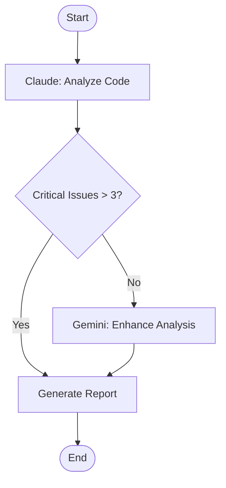

# Code Review Workflow (실제 테스트)

```mermaid
graph TD
    start([Start]) --> analyze_code[Claude: Analyze Code]
    analyze_code --> decision{Critical Issues > 3?}
    decision -->|Yes| generate_report[Generate Report]
    decision -->|No| enhance_analysis[Gemini: Enhance Analysis]
    enhance_analysis --> generate_report
    generate_report --> end_node([End])
```

결과:
- SQL Injection 발견 (Line 45)
- O(n²) 성능 이슈
- 타입 힌트 누락
