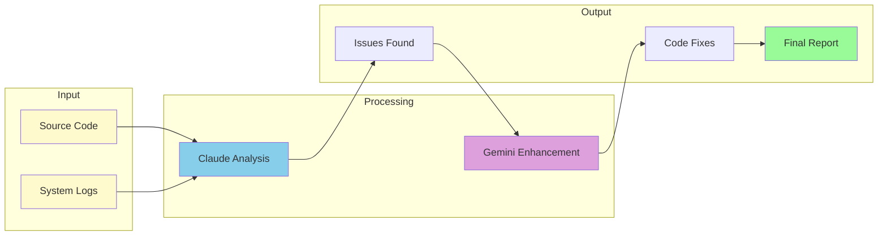

# 데이터 흐름도

```mermaid
graph LR
    subgraph "Input"
        code[Source Code]
        logs[System Logs]
    end
    
    subgraph "Processing"
        claude[Claude Analysis]
        gemini[Gemini Enhancement]
    end
    
    subgraph "Output"
        issues[Issues Found]
        fixes[Code Fixes]
        report[Final Report]
    end
    
    code --> claude
    logs --> claude
    claude --> issues
    issues --> gemini
    gemini --> fixes
    fixes --> report
    
    style code fill:#FFFACD
    style logs fill:#FFFACD
    style claude fill:#87CEEB
    style gemini fill:#DDA0DD
    style report fill:#98FB98
```
