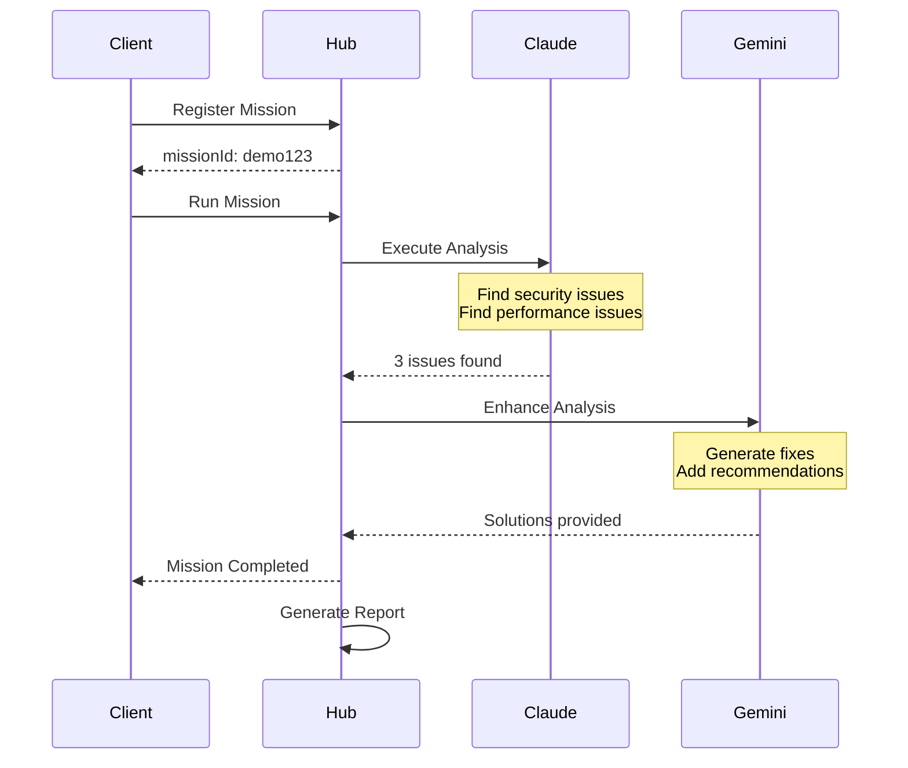

# Mission Execution Flow (demo123)

```mermaid
sequenceDiagram
    participant Client
    participant Hub
    participant Claude
    participant Gemini
    
    Client->>Hub: Register Mission
    Hub-->>Client: missionId: demo123
    
    Client->>Hub: Run Mission
    Hub->>Claude: Execute Analysis
    Note over Claude: Find security issues<br/>Find performance issues
    Claude-->>Hub: 3 issues found
    
    Hub->>Gemini: Enhance Analysis
    Note over Gemini: Generate fixes<br/>Add recommendations
    Gemini-->>Hub: Solutions provided
    
    Hub-->>Client: Mission Completed
    Hub->>Hub: Generate Report
```
