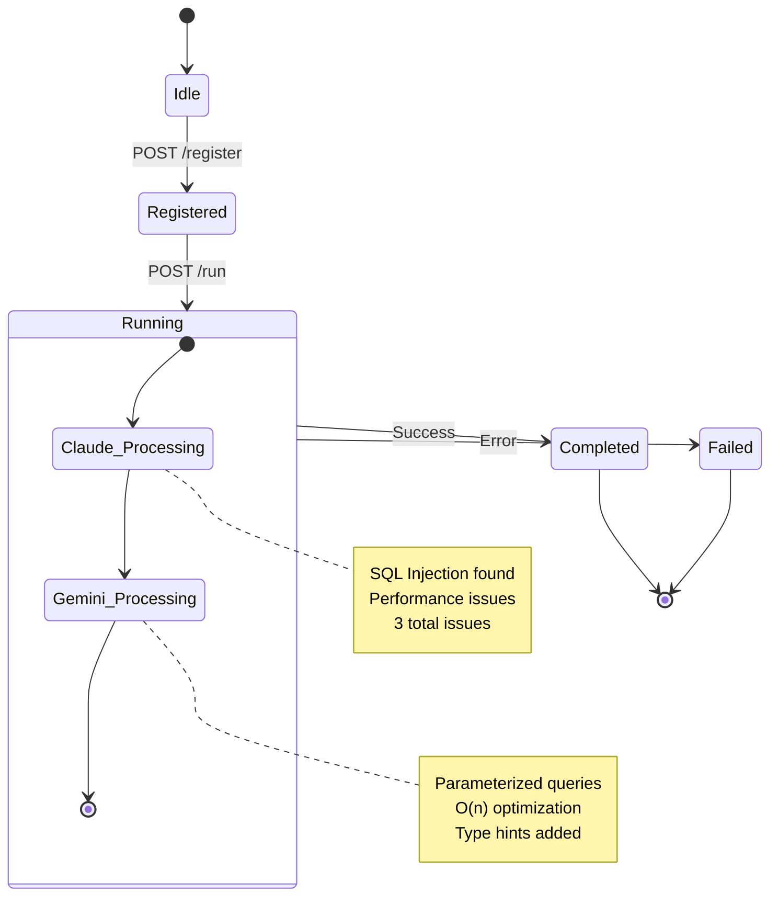

# 시스템 상태 다이어그램

```mermaid
stateDiagram-v2
    [*] --> Idle
    Idle --> Registered: POST /register
    Registered --> Running: POST /run
    
    state Running {
        [*] --> Claude_Processing
        Claude_Processing --> Gemini_Processing
        Gemini_Processing --> [*]
    }
    
    Running --> Completed: Success
    Running --> Failed: Error
    
    Completed --> [*]
    Failed --> [*]
    
    note right of Claude_Processing : SQL Injection found<br/>Performance issues<br/>3 total issues
    note right of Gemini_Processing : Parameterized queries<br/>O(n) optimization<br/>Type hints added
```
