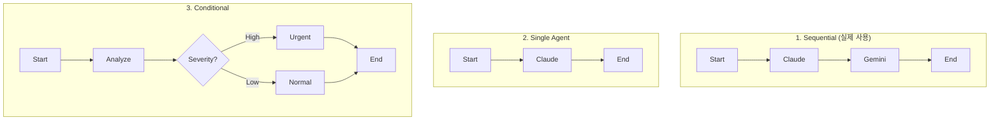

# 테스트한 워크플로우 패턴들

```mermaid
graph TD
    subgraph "1. Sequential (실제 사용)"
        A1[Start] --> A2[Claude]
        A2 --> A3[Gemini]
        A3 --> A4[End]
    end
    
    subgraph "2. Single Agent"
        B1[Start] --> B2[Claude]
        B2 --> B3[End]
    end
    
    subgraph "3. Conditional"
        C1[Start] --> C2[Analyze]
        C2 --> C3{Severity?}
        C3 -->|High| C4[Urgent]
        C3 -->|Low| C5[Normal]
        C4 --> C6[End]
        C5 --> C6
    end
```
