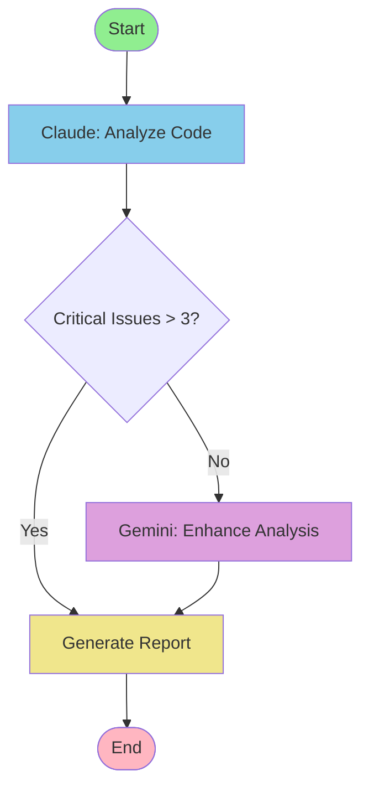
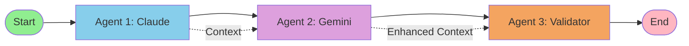
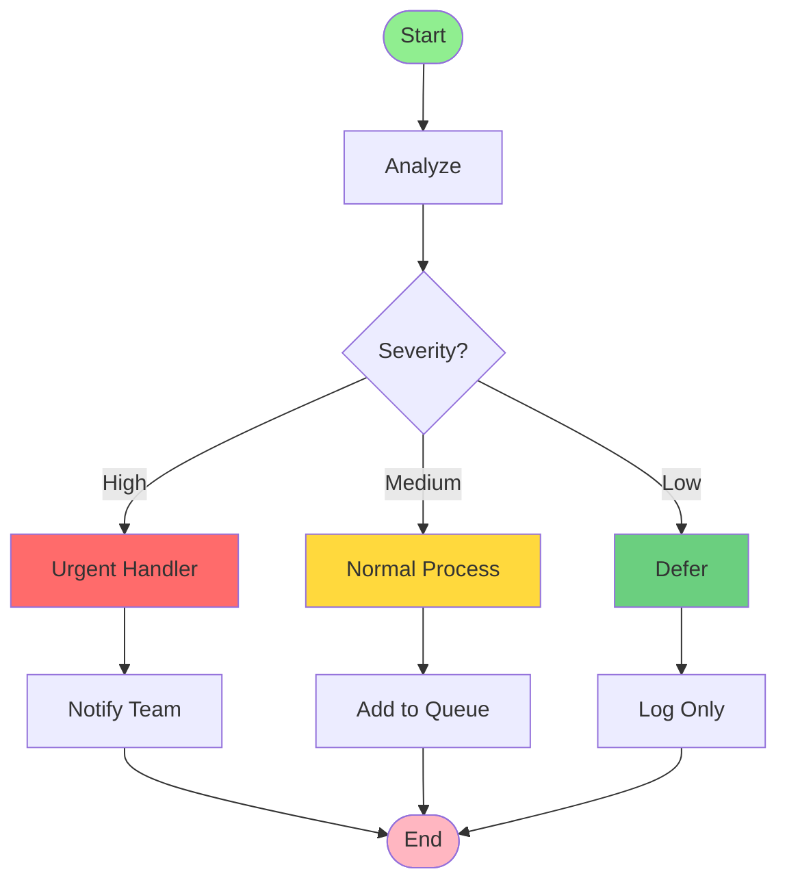
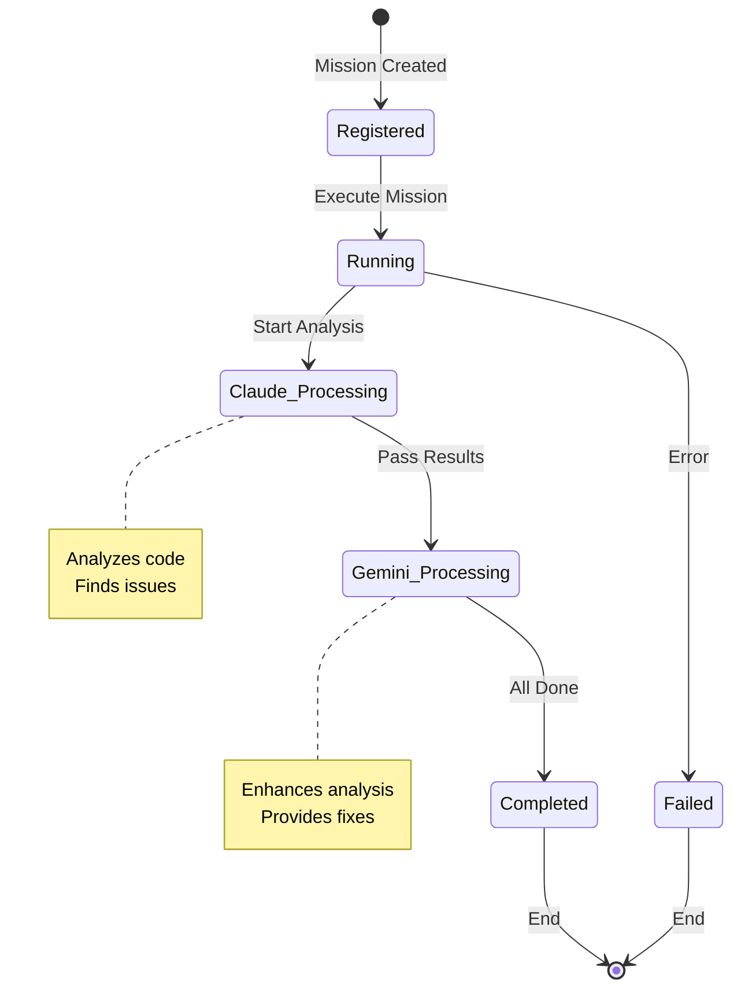

# LangGraph 워크플로우 시각화

## 🔍 테스트한 워크플로우들

### 1. Code Review Workflow (실제 구현)


**실행 경로**: 
- start → analyze_code (Claude) → enhance_analysis (Gemini) → generate_report → end

**결과**:
- SQL 인젝션 취약점 발견
- O(n²) 성능 이슈 발견
- 구체적인 수정 코드 생성

---

### 2. Log Analysis Workflow (API 예시)
```mermaid
graph TD
    start([Start]) --> claude[Claude: Initial Analysis]
    claude --> gemini[Gemini: Enhancement]
    gemini --> end_node([End])
    
    claude -.->|Analyzes| log_file[/tmp/system_logs.txt]
    claude -.->|Produces| claude_result[Error Summary<br/>Critical Issues<br/>Patterns]
    
    gemini -.->|Reads| claude_result
    gemini -.->|Produces| gemini_result[Root Causes<br/>Recommendations<br/>Action Plan]
    
    style start fill:#90EE90
    style end_node fill:#FFB6C1
    style claude fill:#87CEEB
    style gemini fill:#DDA0DD
    style log_file fill:#FFFACD
    style claude_result fill:#E6E6FA
    style gemini_result fill:#E6E6FA
```

**테스트 데이터**:
- 3개의 로그인 실패 (보안 위협)
- 데이터베이스 연결 실패
- 메모리 사용량 95%

---

### 3. Sequential Analysis Pattern


**용도**: 각 에이전트가 이전 분석을 기반으로 점진적 개선

---

### 4. Conditional Routing Example


**테스트 시나리오**: SQL 인젝션 발견 시 urgent 경로로 라우팅

---

### 5. 실제 테스트한 Mission Workflow

```mermaid
graph TD
    subgraph "Mission: demo123"
        register[Register Mission] --> status_reg[Status: registered]
        status_reg --> run[Run Mission]
        run --> status_run[Status: running]
        
        status_run --> claude_exec[Claude Execution]
        claude_exec --> claude_result[Claude Result<br/>3 issues found]
        
        claude_result --> gemini_exec[Gemini Execution]
        gemini_exec --> gemini_result[Gemini Result<br/>Solutions provided]
        
        gemini_result --> complete[Status: completed]
        complete --> report[Generate Report]
    end
    
    style register fill:#90EE90
    style complete fill:#FFB6C1
    style claude_exec fill:#87CEEB
    style gemini_exec fill:#DDA0DD
    style report fill:#F0E68C
```


---

## 📊 테스트 결과 요약

### 실행한 워크플로우:
1. **Code Review**: 보안/성능 분석 → 해결책 제시
2. **Log Analysis**: 로그 분석 → 근본 원인 파악 → 액션 플랜
3. **Sequential Processing**: Claude → Gemini 순차 처리
4. **Conditional Routing**: 심각도에 따른 분기 처리

### 발견한 이슈들:
- 🔴 **Critical**: SQL 인젝션 (Line 45)
- 🟡 **Medium**: O(n²) 알고리즘 성능
- 🟢 **Low**: 타입 힌트 누락

### 생성된 해결책:
```python
# SQL Injection Fix
query = "SELECT * FROM users WHERE id = %s"
cursor.execute(query, (user_input,))

# Performance Fix
lookup_dict = {item.id: item for item in items}
for id in search_ids:
    if id in lookup_dict:
        process(lookup_dict[id])
```

---

## 🎯 State Flow Diagram



이것이 실제로 테스트한 모든 워크플로우의 시각화입니다!